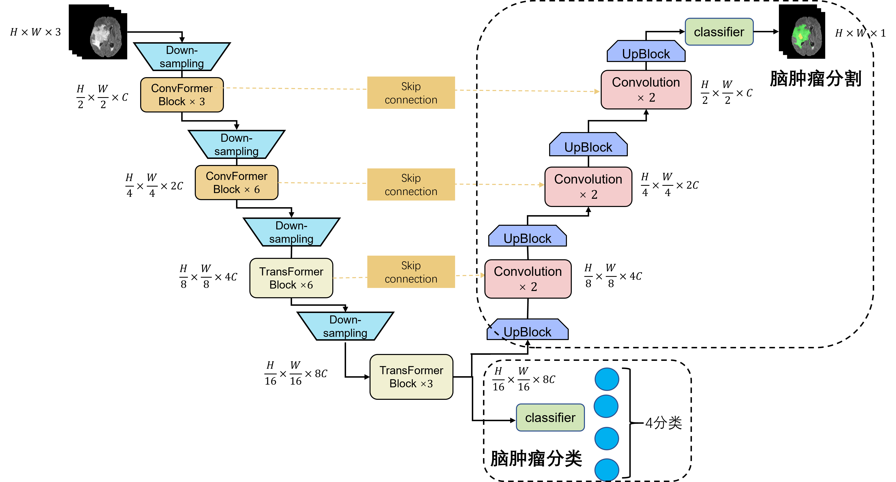
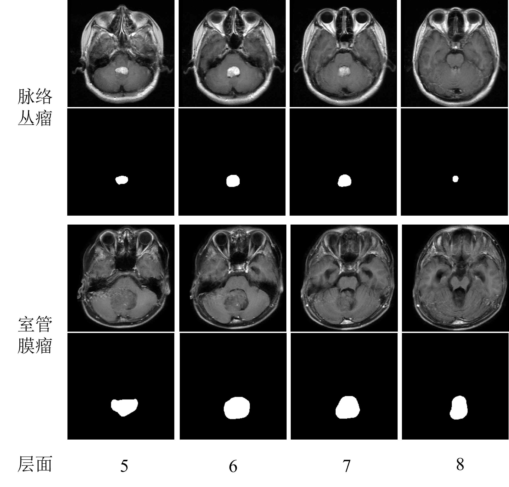
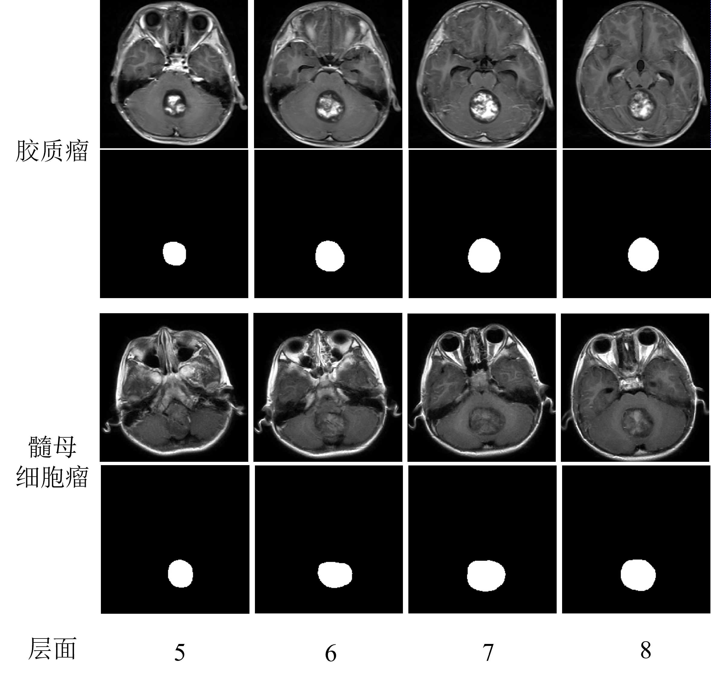

# Brain-Tumor-Classification
> End-to-end multi-task learning for brain tumor classification and segmentation. 
### Main architecture

### Segment visualization



## Installation
1. Clone the repository

`git clone https://github.com/sd0809/Brain-Tumor-Classification.git`

2. Create a conda environment and install the required packages

```
conda create -n env_name python==3.8
conda activate env_name
pip install -r requirements.txt
```

## Data
First, convert your data into HDF5 format to accelerate the training precess with `create_hdf5.py`.

Then, put your data in `hdf5_path` and put your tumor mask dir in `mask_path`

## Train & Valid
`sh run.sh`

## 
If you find our project useful, please consider star it  : )